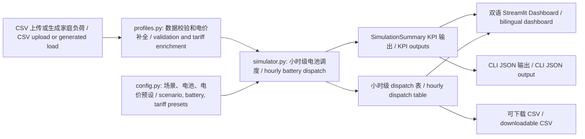

# ReVolt 二次利用 EV 电池储能模拟器 / Second-Life EV Battery Storage Simulator

一个面向家庭储能商业场景的 Python 仿真工具和 Streamlit Dashboard，用来评估二次利用电动车电池是否能降低家庭电费、实现峰谷套利、提供备电能力，并估算碳减排影响。

A Python simulation tool and Streamlit dashboard for evaluating whether second-life EV batteries can reduce household electricity bills, shift peak demand, support backup power, and lower carbon impact.

GitHub link: `https://github.com/ZiruiWang2021/revolt-second-life-battery-simulator`


## 项目概览 / Project Overview

- 完整可运行的能源系统仿真项目，不只是概念说明。
- 把电气工程假设、电价机制、家庭用户场景和商业回本模型连接在一起。
- 包含 Dashboard、CLI、单元测试、GitHub Actions、架构图、技术博客和供应链/数据管理文档。
- 覆盖三类用户：租房用户、低收入家庭、备电韧性场景。
- 中文和英文内容并行，方便不同背景的读者快速理解业务逻辑与技术实现。

English:

- A runnable energy-system simulation project, not just a concept note.
- Connects electrical engineering assumptions with tariffs, household economics, and customer segments.
- Includes a dashboard, CLI, tests, GitHub Actions, architecture diagram, technical blog, and strategy docs.
- Covers renter, low-income household, and backup-power use cases.
- Presents the same project context in both Chinese and English.

## 技术亮点 / Technical Highlights

- 模块化 Python 包：`config.py`、`profiles.py`、`simulator.py` 分离配置、数据处理和仿真逻辑。
- 小时级 dispatch 模型：考虑电池容量、往返效率、SOC 储备、充放电功率、循环寿命、电价和碳强度。
- Dashboard 与 CLI 共用同一个核心模型，避免“前端展示”和“后端逻辑”脱节。
- 输出 KPI 包括节省电费、年化收益、回本周期、套利价值、峰值削减、碳减排、等效完整循环和备电小时数。
- `tests/` 覆盖关键会计逻辑，GitHub Actions 在 Python 3.10、3.11、3.12 上自动测试。

English:

- Modular Python package with typed dataclasses and unit tests.
- Hourly dispatch model with battery capacity, efficiency, reserve SOC, power limits, cycle life, tariff, and carbon intensity.
- Streamlit dashboard reuses the same core model as the CLI.
- KPI outputs include bill savings, annualized savings, payback, arbitrage value, peak reduction, carbon reduction, equivalent full cycles, and backup hours.
- GitHub Actions runs automated tests across Python 3.10, 3.11, and 3.12.

## Demo / 演示

```bash
python -m revolt_simulator --scenario renter --days 7
```

示例输出 / Example output:

```json
{
  "days_modeled": 7.0,
  "baseline_bill": 34.62,
  "battery_bill": 32.47,
  "bill_savings": 2.15,
  "annualized_savings": 112.17,
  "payback_years": 9.14,
  "arbitrage_value": 2.15,
  "peak_energy_shifted_kwh": 51.48,
  "peak_grid_reduction_pct": 22.76,
  "carbon_reduction_kg": 2.25,
  "estimated_cycle_life_years": 4.3
}
```

## 安装方法 / Installation

```bash
python -m venv .venv
.venv\Scripts\activate
pip install -r requirements.txt
```

运行单元测试 / Run tests:

```bash
python -m unittest discover -s tests
```

启动 Dashboard / Run the dashboard:

```bash
streamlit run dashboard/app.py
```

## 示例输入 / Example Input

最小 CSV 输入只需要两列 / Minimum required CSV columns:

| column | type | 中文说明 | English description |
| --- | --- | --- | --- |
| `timestamp` | datetime | 小时时间戳 | Hourly timestamp |
| `load_kwh` | float | 该小时家庭用电量 | Household electricity consumed during the hour |

可选列 / Optional columns:

| column | type | 中文说明 | English description |
| --- | --- | --- | --- |
| `import_price_per_kwh` | float | 该小时购电价格，缺失时使用预设电价 | Electricity import tariff for the hour; preset fills missing values |
| `carbon_kg_per_kwh` | float | 该小时电网碳强度，缺失时使用预设碳强度 | Grid carbon intensity for the hour; preset fills missing values |

Small sample:

```csv
timestamp,load_kwh
2026-01-01 00:00:00,0.356
2026-01-01 01:00:00,0.337
2026-01-01 17:00:00,0.903
2026-01-01 18:00:00,1.042
```

完整示例见 / Fuller example: `data/sample_household_profile.csv`

## 项目架构 / Architecture



## 文件结构 / Repository Structure

```text
revolt_simulator/        核心仿真包 / Core simulation package
dashboard/app.py         双语 Streamlit Dashboard / Bilingual Streamlit dashboard
data/                    示例输入数据 / Example input data
docs/                    供应链、数据策略、模型假设、博客 / Strategy docs, assumptions, blog
tests/                   单元测试 / Unit tests
.github/workflows/       GitHub Actions 自动测试 / CI workflow
assets/                  截图和展示素材 / Screenshots and visual assets
```

## 仿真逻辑 / Model Summary

模型使用透明的小时级规则，而不是黑盒优化器：

1. 当电价处于高价区间时，电池向家庭负荷放电，同时遵守 SOC 储备和最大放电功率。
2. 当电价处于低价区间时，电池从电网充电，同时遵守容量和最大充电功率。
3. 中间价格区间保持不动作。

English:

1. During high-price hours, the battery discharges to serve household load while respecting reserve SOC and discharge power.
2. During low-price hours, the battery charges from the grid while respecting capacity and charge power.
3. During middle-price hours, the battery stays idle.

Round-trip efficiency is split into charge and discharge efficiency. Cycle-life use is estimated through equivalent full cycles and annualized for lifecycle context.

## Dashboard 场景 / Dashboard Scenarios

| scenario | 中文场景 | business purpose | modelling emphasis |
| --- | --- | --- | --- |
| `renter` | 租房用户 | Portable or lease-style storage | 小容量、低安装成本、快速判断可负担性 |
| `low_income` | 低收入家庭 | Subsidy-supported household storage | 补贴、电费减负、峰值负担降低 |
| `backup` | 备电韧性 | Resilience-focused storage | 更大电池、更高保留 SOC、停电备份 |

## 测试与 CI / Tests And CI

Local:

```bash
python -m unittest discover -s tests
```

GitHub Actions:

- Workflow: `.github/workflows/tests.yml`
- Trigger: push and pull request
- Matrix: Python 3.10, 3.11, 3.12

## 文档 / Documentation

- `docs/project_overview_zh_en.md`：中英双语项目介绍 / bilingual project overview
- `docs/technical_blog.md`：配套技术博客 / technical blog
- `docs/supply_chain_strategy.md`：供应链策略 / supply chain strategy
- `docs/data_management_strategy.md`：数据管理策略 / data management strategy
- `docs/model_assumptions.md`：模型假设 / model assumptions

## 局限性 / Limitations

- 当前 dispatch 是透明启发式规则，不是线性规划或强化学习优化器。
- 暂未加入太阳能 PV 出口、需量电费、需求响应事件和市场级补贴数据库。
- 电池衰减用等效完整循环估算，不是电化学老化模型。
- 碳减排依赖电价时段对应的碳强度假设；生产级碳声明需要区域小时级电网数据。
- 安装成本和补贴是场景假设，不是实时市场报价。

English:

- The dispatch strategy is a transparent heuristic, not a full optimization solver.
- Solar PV export, demand charges, demand response, and market-specific incentive databases are not modelled yet.
- Battery degradation is estimated through equivalent full cycles, not electrochemical ageing.
- Carbon impact depends on tariff-period carbon assumptions unless hourly CSV data is supplied.
- Installation cost and incentive values are scenario assumptions, not market quotes.

## 后续工作 / Future Work

- 加入太阳能 PV 协同优化和上网补偿。
- 加入停电事件仿真和关键负荷曲线。
- 用线性规划替换启发式 dispatch。
- 按放电深度、温度和 C-rate 建模电池衰减。
- 加入二次利用电池供应预测和资产追踪。
- 部署公开 Streamlit demo，便于直接在线试用。
