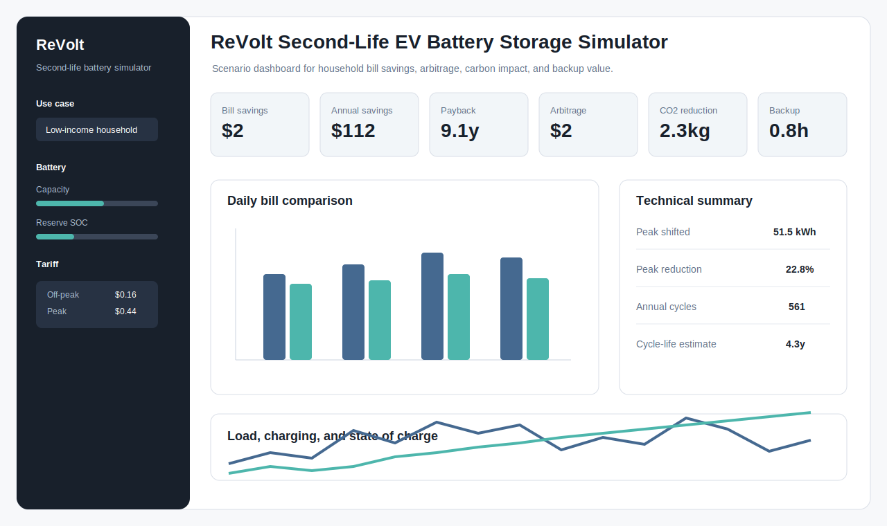
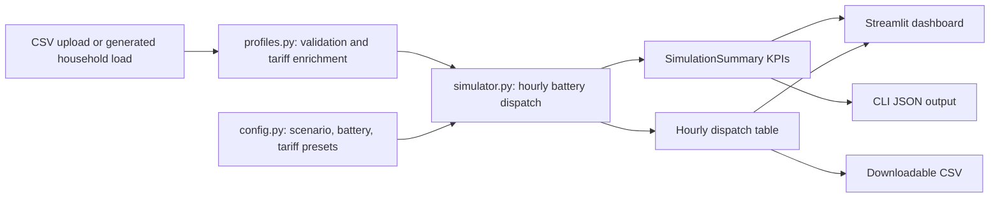

# ReVolt Second-Life EV Battery Storage Simulator

Python simulator and Streamlit dashboard for evaluating whether second-life EV batteries can reduce household electricity bills, shift peak demand, support backup power, and lower carbon impact.

GitHub link: `https://github.com/ZiruiWang2021/revolt-second-life-battery-simulator`



## Quick Signal For Recruiters

- Built a working Python simulation tool for a real energy storage business idea.
- Connects electrical engineering assumptions with household economics.
- Includes a dashboard, tests, documentation, CI, and a technical blog.
- Covers renter, low-income household, and backup-power use cases.
- Shows technical depth without requiring the reader to understand battery chemistry.

## Technical Signal For Interviewers

- Modular simulation package with typed dataclasses and unit tests.
- Hourly dispatch model with battery capacity, efficiency, reserve SOC, power limits, cycle life, tariff, and carbon intensity.
- Streamlit dashboard reuses the same core model as the CLI.
- Transparent model assumptions and limitations are documented.
- GitHub Actions runs automated tests on push and pull request.

## Demo

```bash
python -m revolt_simulator --scenario renter --days 7
```

Example output:

```json
{
  "days_modeled": 7.0,
  "baseline_bill": 34.62,
  "battery_bill": 32.47,
  "bill_savings": 2.15,
  "annualized_savings": 112.17,
  "payback_years": 9.14,
  "arbitrage_value": 2.15,
  "peak_energy_shifted_kwh": 51.48,
  "peak_grid_reduction_pct": 22.76,
  "carbon_reduction_kg": 2.25,
  "estimated_cycle_life_years": 4.3
}
```

## Installation

```bash
python -m venv .venv
.venv\Scripts\activate
pip install -r requirements.txt
```

Run tests:

```bash
python -m unittest discover -s tests
```

Run the dashboard:

```bash
streamlit run dashboard/app.py
```

## Example Input

Minimum required CSV columns:

| column | type | description |
| --- | --- | --- |
| `timestamp` | datetime | Hourly timestamp. |
| `load_kwh` | float | Household electricity consumed during the hour. |

Optional columns:

| column | type | description |
| --- | --- | --- |
| `import_price_per_kwh` | float | Electricity import tariff for the hour. If missing, the selected tariff preset is applied. |
| `carbon_kg_per_kwh` | float | Grid carbon intensity for the hour. If missing, the selected tariff preset is applied. |

Small sample:

```csv
timestamp,load_kwh
2026-01-01 00:00:00,0.356
2026-01-01 01:00:00,0.337
2026-01-01 17:00:00,0.903
2026-01-01 18:00:00,1.042
```

See `data/sample_household_profile.csv` for a fuller example.

## Architecture



## Repository Structure

```text
revolt_simulator/        Core simulation package
dashboard/app.py         Streamlit dashboard
data/                    Example input data
docs/                    Supply chain, data strategy, assumptions, blog
tests/                   Unit tests for the simulator
.github/workflows/       GitHub Actions automated testing
```

## Model Summary

The simulator uses an hourly dispatch rule:

1. If the import price is in the upper tariff band, discharge the battery to serve household load while respecting reserve SOC and max discharge power.
2. If the import price is in the lower tariff band, charge from the grid while respecting capacity and max charge power.
3. Otherwise, leave the battery idle.

Round-trip efficiency is split into charge and discharge efficiency. Cycle-life use is estimated through equivalent full cycles over the modelled period and annualized for lifecycle context.

## Dashboard Scenarios

| scenario | purpose | modelling emphasis |
| --- | --- | --- |
| `renter` | Portable or lease-style storage | Lower capacity, lower installation cost, fast affordability check. |
| `low_income` | Subsidy-supported household storage | Incentives, bill relief, peak burden reduction. |
| `backup` | Resilience-focused storage | Larger battery, higher reserve SOC, outage coverage. |

## Tests And CI

Local:

```bash
python -m unittest discover -s tests
```

GitHub Actions:

- Workflow: `.github/workflows/tests.yml`
- Trigger: push and pull request
- Matrix: Python 3.10, 3.11, 3.12

## Documentation

- `docs/supply_chain_strategy.md`
- `docs/data_management_strategy.md`
- `docs/model_assumptions.md`
- `docs/technical_blog.md`

## Limitations

- The dispatch strategy is a transparent heuristic, not a full optimization solver.
- Solar PV export, demand charges, and utility demand response events are not modelled yet.
- Battery degradation is estimated through equivalent full cycles, not electrochemical ageing.
- Carbon impact assumes tariff-period carbon intensity unless a CSV provides hourly values.
- Installation cost and incentive values are scenario assumptions, not market quotes.

## Future Work

- Add solar PV co-optimization and export compensation.
- Add outage event simulation with critical-load profiles.
- Replace heuristic dispatch with linear programming optimization.
- Model degradation by depth of discharge, temperature, and C-rate.
- Add fleet-level second-life battery supply forecasting.
- Publish a hosted Streamlit demo after choosing a deployment target.
